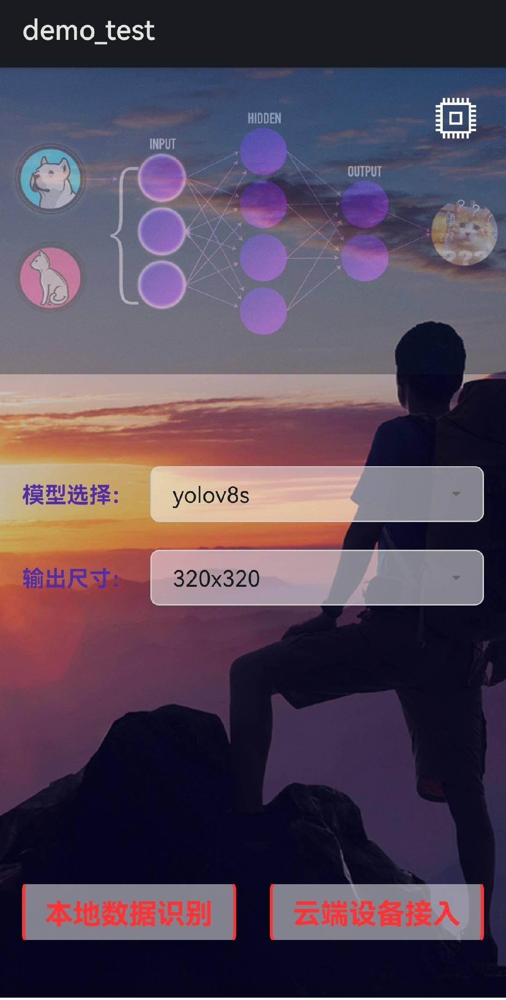
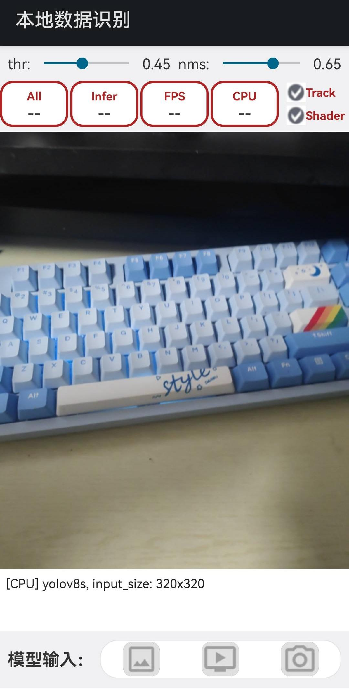
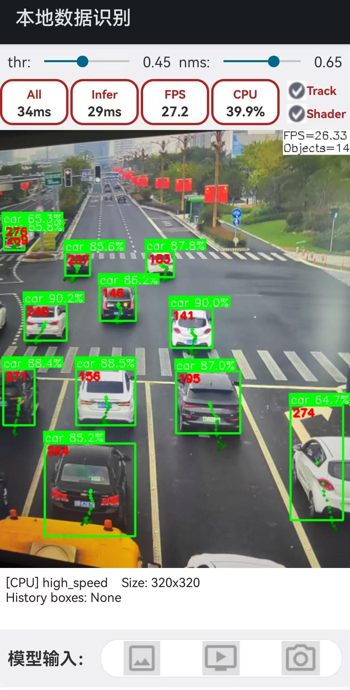
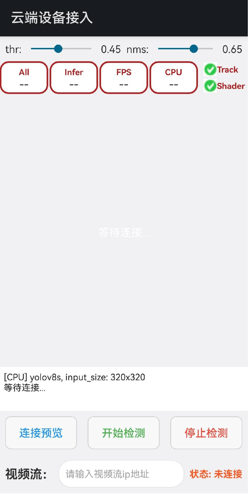

# StreamDetect-FFncnn

基于腾讯 ncnn 深度学习推理框架的 Android 平台 YOLOv8 目标检测应用，实现本地及云端数据的解码-推理-跟踪-显示
支持多种 AI 模型、本地检测、云端检测、目标跟踪、实例分割等功能。

## 📋 目录

- [项目简介](#项目简介)
- [功能特性](#功能特性)
- [环境搭建](#环境搭建)
- [工程结构](#工程结构)
- [核心依赖库](#核心依赖库)
- [模型说明](#模型说明)
- [快速开始](#快速开始)
- [功能使用指南](#功能使用指南)
- [技术架构](#技术架构)
- [性能监控](#性能监控)
- [项目截图](#项目截图)

## 🎯 项目简介

本项目是一个基于 **ncnn** 框架开发的 Android 平台 AI 视觉检测应用，集成了多种深度学习模型，支持目标检测、实例分割、姿态估计、人脸检测等多种计算机视觉任务。项目采用 **JNI** 实现 Java 与 C++ 的交互，通过 **ncnn** 进行高效的神经网络推理，支持 **CPU** 和 **GPU（Vulkan）** 两种推理模式。

> **🎉 代码结构优化说明**：Java层代码已进行深度精简优化，将原来的10个文件6个子文件夹精简为6个文件1个子文件夹（jni），通过合并相关类简化目录层级，大幅提高代码可维护性。JniBridge保留在jni文件夹中以匹配C++层的JNI函数签名，功能保持完全一致。

### 主要特点

- ✅ **多模型支持**：集成 YOLOv8、NanoDet、姿态估计、人脸检测等 9 种模型
- ✅ **双模式推理**：支持 CPU 和 GPU（Vulkan）推理
- ✅ **实时检测**：相机实时预览检测、图片检测、视频文件检测
- ✅ **云端接入**：支持 RTSP/HTTP/HTTPS 网络视频流检测
- ✅ **目标跟踪**：基于 BYTETracker 的多目标跟踪算法
- ✅ **实例分割**：YOLOv8-Seg 语义分割支持
- ✅ **性能监控**：实时 FPS、推理耗时、CPU 使用率监控
- ✅ **日志输出**：详细的检测日志和调试信息

---

## ✨ 功能特性

### 1. 检测功能
- **目标检测**：YOLOv8n/s、NanoDet、High_Speed 模型
- **实例分割**：YOLOv8s-seg 语义分割
- **姿态估计**：SimplePose 人体关键点检测
- **人脸检测**：DbFace、YoloFace-500k、FacelandMark
- **组合检测**：PoseFace 组合模型（人体+姿态+人脸）

### 2. 跟踪功能
- **多目标跟踪**：基于 BYTETracker 算法
- **轨迹绘制**：实时显示目标运动轨迹
- **ID 管理**：稳定的目标 ID 分配和跟踪

### 3. 资源监控
- **FPS 监控**：实时帧率统计
- **推理耗时**：单次推理时间统计
- **总耗时**：包含预处理和后处理的总时间
- **CPU 使用率**：进程 CPU 占用监控

### 4. 日志输出
- **检测结果日志**：目标类别、数量、置信度
- **参数配置日志**：模型、输入尺寸、设备类型
- **错误信息日志**：异常捕获和错误提示

### 5. 本地检测
- **相机实时检测**：Android Camera2 API
- **图片检测**：从相册选择图片进行检测
- **视频检测**：FFmpeg 解码视频文件检测

### 6. 云端检测
- **网络流接入**：支持 RTSP/HTTP/HTTPS 协议
- **实时预览**：网络视频流实时预览
- **流式检测**：对网络流进行实时 AI 检测

---

## 🛠️ 环境搭建

### 系统要求

- **操作系统**：Windows 10/11 或 macOS 或 Linux
- **开发环境**：Android Studio（推荐最新稳定版）

### 必需环境

#### 1. JDK 配置
- **版本**：JDK 17.0
- **配置**：设置 `JAVA_HOME` 环境变量指向 JDK 17 安装目录

```bash
# 验证 JDK 版本
java -version
# 应该显示：openjdk version "17.x.x"
```

#### 2. Android SDK 配置
- **Android SDK Platform**：Android 12 (API Level 31)
- **Build Tools**：建议安装 33.0.1 或更高版本
- **NDK 版本**：21.x（具体版本：25.1.8937393）

**SDK 安装步骤**：
1. 打开 Android Studio
2. 进入 `Tools > SDK Manager`
3. 在 `SDK Platforms` 标签页安装：
   - ✅ Android 12.0 (API Level 31)
   - ✅ Android 13.0 (API Level 33)（推荐）
   - ✅ Android 14.0 (API Level 34)（推荐）
4. 在 `SDK Tools` 标签页安装：
   - ✅ Android SDK Build-Tools 33.0.1（或更高版本）
   - ✅ CMake 3.10（或更高版本，项目要求 3.22.1）
   - ✅ NDK (Side by side) 21.x（项目使用 25.1.8937393）
   - ✅ Android SDK Platform-Tools
   - ✅ Android SDK Command-line Tools

#### 3. CMake 配置
- **最低版本**：CMake 3.10
- **项目要求**：CMake 3.22.1（在 `app/build.gradle` 中指定）

**安装位置**：Android SDK 目录下的 `cmake` 文件夹
```
SDK_ROOT/cmake/3.22.1/
```

#### 4. Gradle 配置
- **Gradle 插件版本**：7.2.0 或 8.1.0（项目使用 8.1.0）
- **Gradle 版本**：与插件版本匹配

**配置检查**：
- 项目根目录 `build.gradle` 中查看插件版本
- `gradle/wrapper/gradle-wrapper.properties` 中查看 Gradle 版本

#### 5. NDK 配置
- **版本**：21.x（项目实际使用 25.1.8937393）
- **配置位置**：`app/build.gradle` 中指定
```gradle
ndkVersion "25.1.8937393"
```

### 环境变量配置

#### Windows
```batch
# 设置 JDK 路径
set JAVA_HOME=C:\Program Files\Java\jdk-17

# 设置 Android SDK 路径
set ANDROID_HOME=C:\Users\YourName\AppData\Local\Android\Sdk

# 添加到 PATH
set PATH=%JAVA_HOME%\bin;%ANDROID_HOME%\platform-tools;%PATH%
```

#### macOS/Linux
```bash
# 设置 JDK 路径
export JAVA_HOME=/Library/Java/JavaVirtualMachines/jdk-17.jdk/Contents/Home

# 设置 Android SDK 路径
export ANDROID_HOME=$HOME/Library/Android/sdk

# 添加到 PATH
export PATH=$JAVA_HOME/bin:$ANDROID_HOME/platform-tools:$PATH
```

### 项目配置验证

1. **打开项目**
   ```bash
   # 使用 Android Studio 打开项目根目录
   ```

2. **同步 Gradle**
   - Android Studio 会自动同步，或手动点击 `Sync Project with Gradle Files`

3. **检查配置**
   - 确认 `local.properties` 中 `sdk.dir` 指向正确的 Android SDK 路径
   - 确认 NDK 版本与 `app/build.gradle` 中配置一致

---

## 📁 工程结构

```
ncnn-android-yolov8/
│
├── app/                                    # 主应用模块
│   ├── build.gradle                       # 应用构建配置
│   ├── proguard-rules.pro                 # 代码混淆规则
│   │
│   └── src/
│       └── main/
│           ├── AndroidManifest.xml        # 应用清单文件
│           │
│           ├── assets/                    # 模型资源文件
│           │   ├── YoloV8n.param/.bin     # YOLOv8n 模型
│           │   ├── YoloV8s.param/.bin     # YOLOv8s 模型
│           │   ├── Yolov8Seg.param/.bin   # YOLOv8 分割模型
│           │   ├── NanoDet.param/.bin     # NanoDet 模型
│           │   ├── High_Speed.param/.bin  # 高速检测模型
│           │   ├── SimplePose.param/.bin  # 姿态估计模型
│           │   ├── DbFace.param/.bin      # 人脸检测模型
│           │   ├── YoloFace-500k.param/.bin
│           │   └── LandMark106.param/.bin # 人脸关键点模型
│           │
│           ├── java/                      # Java 源代码
│           │   └── NcnnTencent/
│           │       ├── WelcomeActivity.java          # 欢迎界面（模型选择）
│           │       │
│           │       ├── LocalDetect/                  # 本地检测模块
│           │       │   ├── MainLocalActivity.java    # 本地检测主界面
│           │       │   └── presenter/
│           │       │       └── MainPresenter.java    # MVP 架构 Presenter
│           │       │
│           │       ├── CloudDetect/                  # 云端检测模块
│           │       │   ├── MainCloudActivity.java    # 云端检测主界面
│           │       │   ├── NetworkVideoManager.java  # 网络流管理器
│           │       │   └── presenter/
│           │       │       └── NetworkPresenter.java # MVP 架构 Presenter
│           │       │
│           │       └── common/                       # 公共模块 (精简结构)
│           │           ├── InferenceConfig.java      # 推理配置类
│           │           ├── ImageUtils.java           # 图片处理工具
│           │           ├── jni/                      # JNI 桥接层
│           │           │   └── JniBridge.java        # JNI 接口封装
│           │           ├── Models.java               # 数据模型集合
│           │           │   ├── DetectSummary         #   - 检测结果摘要
│           │           │   ├── CameraModel           #   - 相机模型
│           │           │   ├── InferenceModel        #   - 推理模型
│           │           │   └── NetworkModel          #   - 网络流模型
│           │           ├── Monitor.java              # 监控器集合
│           │           │   ├── SystemMonitor         #   - 系统监控
│           │           │   └── InferenceMonitor      #   - 推理监控
│           │           └── UiUpdater.java            # UI 更新工具
│           │
│           ├── jni/                       # C++/JNI 原生代码
│           │   ├── CMakeLists.txt         # CMake 构建配置
│           │   │
│           │   ├── camera_jni.cpp         # 相机 JNI 接口
│           │   ├── ffmpeg_jni.cpp         # FFmpeg 视频 JNI 接口
│           │   ├── ndkcamera.cpp/.h       # Android NDK Camera 封装
│           │   ├── vision_base.cpp/.h     # 视觉基础类
│           │   ├── vision_infer.cpp/.h    # 推理引擎
│           │   ├── IYoloAlgo.h            # 算法接口定义
│           │   │
│           │   ├── detect/                # 检测算法
│           │   │   ├── YoloV8.cpp/.h      # YOLOv8 实现
│           │   │   ├── NanoDet.cpp/.h     # NanoDet 实现
│           │   │   └── HighSpeed.cpp/.h   # 高速检测实现
│           │   │
│           │   ├── seg/                   # 分割算法
│           │   │   └── Yolov8Seg.cpp/.h   # YOLOv8 分割实现
│           │   │
│           │   ├── pose/                  # 姿态估计算法
│           │   │   ├── SimplePose.cpp/.h  # 姿态估计实现
│           │   │   ├── DbFace.cpp/.h      # 人脸检测
│           │   │   ├── FacelandMark.cpp/.h
│           │   │   └── CombinedPoseFace.cpp/.h
│           │   │
│           │   ├── track/                 # 跟踪算法
│           │   │   ├── BYTETracker.cpp/.h # BYTE 跟踪器
│           │   │   ├── STrack.cpp/.h      # 跟踪目标
│           │   │   ├── kalmanFilter.cpp/.h
│           │   │   └── utils.cpp          # 跟踪工具函数
│           │   │
│           │   ├── ncnn-20231027-android-vulkan/  # ncnn 框架库
│           │   │   ├── arm64-v8a/         # ARM64 架构库
│           │   │   ├── armeabi-v7a/       # ARMv7 架构库
│           │   │   ├── x86/               # x86 架构库
│           │   │   └── x86_64/            # x86_64 架构库
│           │   │
│           │   ├── OpenCV-android-sdk/    # OpenCV 库
│           │   ├── ffmpeg-5.9/            # FFmpeg 库
│           │   ├── x264/                  # x264 编码库
│           │   └── eigen-3.3.9/           # Eigen 数学库
│           │
│           └── res/                       # 资源文件
│               ├── layout/                # 布局文件
│               │   ├── activity_welcome.xml
│               │   ├── main.xml
│               │   └── activity_network_stream.xml
│               ├── values/
│               │   ├── strings.xml        # 字符串资源（模型列表等）
│               │   └── colors.xml
│               └── drawable/              # 图片资源
│
├── Screenshots/                           # 项目截图
│   ├── welcome_screen.jpg                 # 欢迎界面
│   ├── local_detect_main_v1.jpg          # 本地检测界面 v1
│   ├── local_detect_main_v2.jpg          # 本地检测界面 v2
│   ├── local_detect_flow.gif             # 本地检测流程动画
│   ├── cloud_detect_main.jpg             # 云端检测界面
│   └── cloud_network_stream.gif          # 云端流检测动画
│
├── build.gradle                           # 项目级构建配置
├── settings.gradle                        # 项目设置
├── gradle.properties                      # Gradle 属性配置
└── README.md                              # 项目说明文档（本文件）
```

### 核心目录说明

#### `app/src/main/java/NcnnTencent/`
- **WelcomeActivity**：应用入口，模型选择和参数配置界面
- **LocalDetect**：本地检测模块，支持相机、图片、视频
- **CloudDetect**：云端检测模块，支持网络视频流
- **common**：公共模块（精简结构），包括：
  - `InferenceConfig.java`：推理配置管理
  - `ImageUtils.java`：图片处理工具
  - `jni/JniBridge.java`：JNI 桥接层（保留在jni文件夹以匹配C++层）
  - `Models.java`：整合所有数据模型和业务模型
  - `Monitor.java`：整合系统监控和推理监控
  - `UiUpdater.java`：UI 更新优化工具

#### `app/src/main/jni/`
- **detect/**：目标检测算法实现（YOLOv8、NanoDet 等）
- **seg/**：实例分割算法实现
- **pose/**：姿态估计和人脸检测算法
- **track/**：多目标跟踪算法（BYTETracker）
- **ncnn-20231027-android-vulkan/**：ncnn 推理框架库

#### `app/src/main/assets/`
- 存放所有 AI 模型的参数文件（`.param`）和权重文件（`.bin`）

---

## 📚 核心依赖库

### 1. ncnn 框架

**ncnn** 是腾讯开源的为手机端极致优化的高性能神经网络前向计算框架。

- **版本**：ncnn-20231027-android-vulkan
- **官方仓库**：https://github.com/Tencent/ncnn
- **许可证**：BSD 3-Clause License

#### ncnn 特性

- ✅ **高性能**：针对 ARM CPU 深度优化
- ✅ **Vulkan 支持**：GPU 加速推理
- ✅ **轻量级**：框架体积小，依赖少
- ✅ **跨平台**：支持 Android、iOS、Linux、Windows

#### ncnn 在本项目中的使用

```cpp
// 模型加载示例（YoloV8.cpp）
int YoloV8::load(AAssetManager* mgr, int modelid, int inputsize, bool use_gpu)
{
    ncnn::set_cpu_powersave(0);
    ncnn::set_omp_num_threads(ncnn::get_big_cpu_count());
    yolo.opt = ncnn::Option();
    
#if NCNN_VULKAN
    yolo.opt.use_vulkan_compute = use_gpu;  // 启用 Vulkan GPU 推理
#endif
    
    yolo.opt.lightmode = true;  // 轻量模式，减少内存使用
    
    // 加载模型文件
    yolo.load_param(mgr, parampath);
    yolo.load_model(mgr, modelpath);
    
    return 0;
}
```

#### CMake 集成

```cmake
# CMakeLists.txt 中配置 ncnn
set(ncnn_DIR ${CMAKE_SOURCE_DIR}/ncnn-20231027-android-vulkan/${ANDROID_ABI}/lib/cmake/ncnn)
find_package(ncnn REQUIRED)

target_link_libraries(yolov8ncnn
    ncnn
    ${OpenCV_LIBS}
    # ... 其他库
)
```

### 2. OpenCV

**OpenCV**（Open Source Computer Vision Library）是一个开源的计算机视觉库。

- **用途**：图像处理、矩阵运算、颜色空间转换
- **在本项目中的使用**：
  - 图像预处理和后处理
  - 目标框绘制
  - 图像缩放和裁剪

### 3. FFmpeg

**FFmpeg** 是一个多媒体处理库。

- **版本**：FFmpeg 5.9
- **用途**：视频文件解码、网络流解码
- **支持格式**：MP4、AVI、RTSP、HTTP 等

### 4. Eigen

**Eigen** 是一个 C++ 模板库，用于线性代数、矩阵和向量运算。

- **版本**：Eigen 3.3.9
- **用途**：数学运算、矩阵计算

### 5. x264

**x264** 是一个开源的 H.264 视频编码器。

- **用途**：视频编码（本项目主要使用解码功能）

### 6. Android NDK Camera

**Android Camera2 NDK API** 用于直接访问相机硬件。

- **文件**：`ndkcamera.cpp/.h`
- **用途**：高效相机预览和图像采集

---

## 🤖 模型说明

项目支持以下 9 种 AI 模型：

| 模型名称 | 类型 | 输入尺寸 | 说明 |
|---------|------|---------|------|
| **high_speed** | 目标检测 | 320×320 / 640×640 | 高速检测模型，轻量级 |
| **YoloV8n** | 目标检测 | 320×320 / 640×640 | YOLOv8 Nano，轻量级 |
| **YoloV8s** | 目标检测 | 320×320 / 640×640 | YOLOv8 Small，标准版 |
| **YoloV8s-seg** | 实例分割 | 320×320 / 640×640 | YOLOv8 分割模型 |
| **NanoDet** | 目标检测 | 320×320 / 640×640 | 轻量级 Anchor-free 检测 |
| **SimplePose** | 姿态估计 | 320×320 / 640×640 | 人体关键点检测（17 点） |
| **DbFace** | 人脸检测 | 固定尺寸 | 人脸检测模型 |
| **FacelandMark** | 人脸关键点 | 固定尺寸 | 106 点人脸关键点 |
| **PoseFace** | 组合模型 | 320×320 / 640×640 | 人体+姿态+人脸组合检测 |

### 模型文件位置

所有模型文件存放在 `app/src/main/assets/` 目录下：

```
assets/
├── High_Speed.param        # 模型结构定义
├── High_Speed.bin          # 模型权重
├── YoloV8n.param
├── YoloV8n.bin
├── YoloV8s.param
├── YoloV8s.bin
├── Yolov8Seg.param
├── Yolov8Seg.bin
├── NanoDet.param
├── NanoDet.bin
├── SimplePose.param
├── SimplePose.bin
├── DbFace.param
├── DbFace.bin
├── PersonDetector.param    # PoseFace 组合模型使用
├── PersonDetector.bin
├── YoloFace-500k.param
├── YoloFace-500k.bin
├── LandMark106.param
└── LandMark106.bin
```

### 模型加载流程

```cpp
// 1. 初始化 ncnn Net
ncnn::Net yolo;

// 2. 配置推理选项
yolo.opt.use_vulkan_compute = use_gpu;  // GPU/CPU 选择
yolo.opt.lightmode = true;              // 轻量模式

// 3. 从 assets 加载模型
yolo.load_param(mgr, "YoloV8n.param");  // 加载结构
yolo.load_model(mgr, "YoloV8n.bin");    // 加载权重

// 4. 创建提取器并推理
ncnn::Extractor ex = yolo.create_extractor();
ex.input("images", input_mat);
ex.extract("output", output_mat);
```

---

## 🚀 快速开始

### 1. 克隆项目

```bash
git clone <repository-url>
cd ncnn-android-yolov8
```

### 2. 配置 Android SDK 路径

编辑 `local.properties` 文件（如果不存在则创建）：

```properties
sdk.dir=C\:\\Users\\YourName\\AppData\\Local\\Android\\Sdk
```

### 3. 同步项目

1. 使用 Android Studio 打开项目
2. 等待 Gradle 同步完成
3. 确认所有依赖下载成功

### 4. 连接设备

- **真机调试**：启用 USB 调试，连接手机
- **模拟器**：创建 ARM64 架构的模拟器（推荐 API Level 31+）

### 5. 编译运行

1. 选择运行配置：`app`
2. 选择目标设备
3. 点击 `Run` 按钮或按 `Shift+F10`

### 6. 首次使用

应用启动后会进入欢迎界面：
1. 选择模型（默认：high_speed）
2. 选择输入尺寸（默认：320×320）
3. 选择推理设备（CPU/GPU）
4. 点击"进入检测"开始本地检测，或点击"云端设备接入"进行网络流检测

---

## 📖 功能使用指南

### 本地检测功能

#### 1. 相机实时检测

1. 在欢迎界面配置模型和参数
2. 进入本地检测界面
3. 点击相机图标按钮，授予相机权限
4. 实时预览画面，自动进行目标检测
5. 可调节置信度阈值和 NMS 阈值
6. 可启用/禁用目标跟踪和轨迹绘制

**操作说明**：
- **置信度阈值**：滑动条调节，范围 0.00-1.00
- **NMS 阈值**：滑动条调节，范围 0.00-1.00
- **跟踪开关**：启用多目标跟踪
- **轨迹开关**：显示目标运动轨迹

#### 2. 图片检测

1. 点击图片图标按钮
2. 从相册选择图片
3. 自动进行检测并显示结果
4. 可查看检测到的目标类别和置信度

#### 3. 视频检测

1. 点击视频图标按钮
2. 选择视频文件
3. 使用 FFmpeg 逐帧解码
4. 对每一帧进行检测
5. 显示检测结果

### 云端检测功能

#### 1. 网络流接入

1. 在欢迎界面配置模型和参数
2. 进入云端检测界面
3. 输入网络流地址（支持格式）：
   - **RTSP**：`rtsp://192.168.1.100:554/stream`
   - **HTTP**：`http://192.168.1.100:8080/video`
   - **HTTPS**：`https://example.com/stream`
4. 点击"连接预览"按钮
5. 等待连接成功，显示预览画面
6. 点击"开始检测"进行 AI 检测

#### 2. 检测参数调节

- **置信度阈值**：实时调节检测灵敏度
- **NMS 阈值**：控制目标框重叠抑制
- **跟踪开关**：启用/禁用目标跟踪
- **轨迹开关**：显示/隐藏运动轨迹

#### 3. 监控信息

界面底部显示实时监控信息：
- **总耗时**：包含预处理和后处理的完整时间
- **推理耗时**：模型推理时间
- **FPS**：每秒处理帧数
- **CPU 使用率**：进程 CPU 占用百分比

### 性能优化建议

1. **模型选择**：
   - 追求速度：选择 `high_speed` 或 `YoloV8n`
   - 追求精度：选择 `YoloV8s`

2. **输入尺寸**：
   - 320×320：速度快，精度略低
   - 640×640：速度慢，精度高

3. **推理设备**：
   - CPU：兼容性好，功耗低
   - GPU（Vulkan）：速度快，需要设备支持

4. **参数调优**：
   - 置信度阈值：根据场景调整，降低可检测更多目标
   - NMS 阈值：通常 0.4-0.7，过小可能漏检，过大可能误检

---

## 🏗️ 技术架构

### 整体架构

```
┌─────────────────────────────────────────────────┐
│            Android Application Layer             │
│  ┌──────────────┐    ┌──────────────────────┐  │
│  │ WelcomeActivity │  │ MainLocalActivity    │  │
│  │  (模型选择)      │  │  (本地检测)          │  │
│  └──────────────┘    └──────────────────────┘  │
│                              │                   │
│  ┌──────────────────────────┴──────────────────┐│
│  │        Common Module (JNI Bridge)           ││
│  │  ┌────────────┐  ┌──────────────────────┐ ││
│  │  │ JniBridge  │  │ InferenceMonitor     │ ││
│  │  └────────────┘  └──────────────────────┘ ││
│  └──────────────────────────┬──────────────────┘│
└─────────────────────────────┼───────────────────┘
                              │ JNI
┌─────────────────────────────┼───────────────────┐
│           Native Layer (C++)                     │
│  ┌──────────────────────────────────────────┐  │
│  │         JNI Interface Layer              │  │
│  │  camera_jni.cpp / ffmpeg_jni.cpp         │  │
│  └──────────────────┬───────────────────────┘  │
│                     │                            │
│  ┌──────────────────┴────────────────────────┐  │
│  │       Vision Inference Engine             │  │
│  │  ┌────────────────────────────────────┐  │  │
│  │  │  vision_infer.cpp                  │  │  │
│  │  │  - Model Loading                   │  │  │
│  │  │  - Inference Pipeline              │  │  │
│  │  └────────────────────────────────────┘  │  │
│  └──────────────────┬────────────────────────┘  │
│                     │                            │
│  ┌──────────────────┴────────────────────────┐  │
│  │        Algorithm Modules                  │  │
│  │  ┌──────────┐ ┌────────┐ ┌───────────┐  │  │
│  │  │ Detect   │ │  Seg   │ │   Pose    │  │  │
│  │  │ YOLOv8   │ │ YOLOv8 │ │ SimplePose│  │  │
│  │  │ NanoDet  │ │        │ │  DbFace   │  │  │
│  │  └──────────┘ └────────┘ └───────────┘  │  │
│  └──────────────────┬────────────────────────┘  │
│                     │                            │
│  ┌──────────────────┴────────────────────────┐  │
│  │         Tracking Module                   │  │
│  │       BYTETracker (Multi-Object)          │  │
│  └──────────────────┬────────────────────────┘  │
│                     │                            │
└─────────────────────┼────────────────────────────┘
                      │
┌─────────────────────┴────────────────────────────┐
│            Third-party Libraries                  │
│  ┌─────────┐ ┌──────────┐ ┌──────────────┐     │
│  │  ncnn   │ │ OpenCV   │ │   FFmpeg     │     │
│  │ (推理)   │ │(图像处理) │ │  (视频解码)  │     │
│  └─────────┘ └──────────┘ └──────────────┘     │
└──────────────────────────────────────────────────┘
```

### MVP 架构模式

本地检测模块采用 **MVP（Model-View-Presenter）** 架构：

- **Model**：数据模型和业务逻辑（JNI 层）
- **View**：UI 界面（MainLocalActivity）
- **Presenter**：业务逻辑控制器（MainPresenter）

```
View (MainLocalActivity)
    ↓ 用户交互
Presenter (MainPresenter)
    ↓ 调用
Model (JniBridge → Native Code)
    ↓ 返回结果
Presenter
    ↓ 更新
View
```

### JNI 交互流程

```cpp
// Java 层调用
JniBridge.loadModel(assetManager, modelId, deviceType, inputSize);

// JNI 层处理
JNIEXPORT jint JNICALL
Java_NcnnTencent_common_jni_JniBridge_loadModel(...) {
    // C++ 模型加载
    algo->load(mgr, modelid, inputsize, use_gpu);
}

// 推理调用
JniBridge.detect(bitmap, threshold, nms);

// JNI 层推理
JNIEXPORT jobjectArray JNICALL
Java_NcnnTencent_common_jni_JniBridge_detect(...) {
    // C++ 推理
    algo->detect(rgb, objects);
    // 返回检测结果
}
```

---

## 📊 性能监控

项目集成了完善的性能监控系统，实时显示以下指标：

### 监控指标

1. **总耗时（All Time）**
   - 包含图像预处理、模型推理、后处理的总时间
   - 单位：毫秒（ms）
   - 示例：`45ms`

2. **推理耗时（Infer Time）**
   - 仅模型前向推理时间
   - 单位：毫秒（ms）
   - 示例：`25ms`

3. **FPS（Frames Per Second）**
   - 每秒处理帧数
   - 实时计算：`1000 / 总耗时`
   - 示例：`22.2 FPS`

4. **CPU 使用率（CPU Usage）**
   - 进程 CPU 占用百分比
   - 计算方法：`进程CPU时间 / (实际时间 × CPU核心数) × 100%`
   - 示例：`35.5%`

### 监控实现

#### Java 层监控

```java
// InferenceMonitor.java
public class InferenceMonitor {
    private void updateMetrics(DetectSummary summary) {
        // 更新总耗时
        tvAllValue.setText(String.format("%.0fms", summary.allTimeMs));
        
        // 更新推理耗时
        tvInferValue.setText(String.format("%.0fms", summary.inferTimeMs));
        
        // 更新 FPS
        tvFpsValue.setText(String.format("%.1f", summary.fps));
    }
    
    private void updateCpuUsage() {
        long cpuTime = Process.getElapsedCpuTime();
        long realTime = SystemClock.elapsedRealtime();
        // 计算 CPU 使用率
        float cpuUsage = calculateCpuUsage(cpuTime, realTime);
        tvCpuValue.setText(String.format("%.1f%%", cpuUsage));
    }
}
```

#### C++ 层统计

```cpp
// vision_infer.cpp
double t1 = ncnn::get_current_time();  // 开始时间

// 预处理
cv::Mat rgb = bitmapToMat(env, bitmap);

// 推理
algo->detect(rgb, objects);

// 后处理
drawObjects(frame, objects);

double t2 = ncnn::get_current_time();  // 结束时间

// 更新统计信息
g_summary.allTimeMs = (t2 - t1);  // 总耗时
g_summary.fps = 1000.0 / g_summary.allTimeMs;  // FPS
```

### 日志输出

#### 检测结果日志

```
[CPU] YoloV8n, input_size: 320x320
Detect_Info: 3 targets
  [0] person (0.95) @ [120, 80, 180, 280]
  [1] car (0.87) @ [300, 150, 450, 250]
  [2] bicycle (0.72) @ [500, 200, 580, 320]
```

#### 参数配置日志

- 模型名称
- 输入尺寸
- 推理设备（CPU/GPU）
- 置信度阈值
- NMS 阈值
- 跟踪状态

---

## 🖼️ 项目截图

项目截图存放在 `Screenshots/` 目录下，展示了应用的主要界面和功能：

### 1. 欢迎界面（Welcome Screen）



- 模型选择下拉框
- 输入尺寸选择（320×320 / 640×640）
- CPU/GPU 切换按钮
- 本地检测入口
- 云端检测入口

### 2. 本地检测界面（Local Detection）




- 实时相机预览
- 检测结果绘制（目标框、类别、置信度）
- 性能监控信息显示
- 参数调节控件
- 功能按钮（相机/图片/视频）

### 3. 本地检测流程动画


展示本地检测的完整流程和交互效果。

### 4. 云端检测界面（Cloud Detection）



- 网络流地址输入框
- 连接状态显示
- 视频流预览区域
- 检测参数控制
- 连接/检测按钮

### 5. 云端流检测动画


展示网络视频流的实时检测效果。

---

## 🔧 常见问题

### Q1: 编译时找不到 NDK 路径？

**A:** 检查 `local.properties` 文件中的 `ndk.dir` 配置，确保指向正确的 NDK 安装路径。

```properties
ndk.dir=C\:\\Users\\YourName\\AppData\\Local\\Android\\Sdk\\ndk\\25.1.8937393
```

### Q2: 模型文件缺失？

**A:** 确保所有 `.param` 和 `.bin` 文件都在 `app/src/main/assets/` 目录下。如果缺失，需要从模型提供方获取。

### Q3: GPU 推理不工作？

**A:** 
- 检查设备是否支持 Vulkan API
- 确认 ncnn 编译时启用了 Vulkan 支持
- 查看日志是否有 Vulkan 初始化错误

### Q4: 网络流连接失败？

**A:**
- 检查网络流地址格式是否正确
- 确认设备网络连接正常
- 检查防火墙设置
- 查看日志中的详细错误信息

### Q5: 检测速度慢？

**A:**
- 尝试使用更小的模型（如 `high_speed` 或 `YoloV8n`）
- 降低输入尺寸（320×320）
- 启用 GPU 推理（如果设备支持）
- 关闭跟踪功能（如果不需要）

---

## 📝 开发说明

### 添加新模型

1. 将模型文件（`.param` 和 `.bin`）放入 `app/src/main/assets/`
2. 实现模型类，继承 `IYoloAlgo` 接口
3. 在 `vision_infer.cpp` 中注册新模型
4. 在 `strings.xml` 中添加模型名称

### 修改检测参数

检测参数在 `vision_base.h` 中定义：

```cpp
extern float g_threshold;  // 置信度阈值
extern float g_nms;        // NMS 阈值
extern bool g_track_enabled;  // 跟踪开关
```

### 自定义绘制

绘制逻辑在 `vision_infer.cpp` 的 `drawObjects()` 函数中，可以修改：
- 目标框颜色和样式
- 文字显示格式
- 轨迹绘制样式

---
